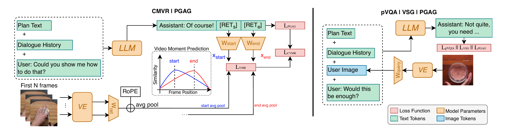

# VIGiA: Instructional Video Guidance via Dialogue Reasoning and Retrieval

This repository is the official implementation of **VIGiA** (Visual and Instructional Guiding Assistant), a multimodal dialogue model for conversational instructional plan guidance, accepted at **EACL 2026**.

VIGiA assists users through complex multi-step procedures (e.g., cooking recipes, DIY tasks) via interactive dialogue. It incorporates two key capability types: (1) **multimodal plan reasoning**, enabling the model to align uni- and multimodal queries with the current task plan, and (2) **plan-based retrieval**, allowing it to retrieve relevant plan steps as text or video moments.

<p align="center">
  
</p>

## Model Weights

Model weights will be available soon. <!-- TODO: add link -->

## InstructionVidDial Dataset

The InstructionVidDial dataset will be available soon. <!-- TODO: add link -->

InstructionVidDial is a multimodal dialogue dataset for conversational plan guidance that extends TastyVidDial with:
- **DIY plans** sourced from COIN, expanding coverage beyond cooking
- **Plan-aware VQA (pVQA)** turns naturally woven into dialogues

The dataset contains 6,760 dialogues with ~114k turns, covering both Cooking and DIY domains, with a mix of textual plan-grounded answer generation, pVQA, visually-informed step generation (VSG), and conversational video moment retrieval (CVMR) requests.

## Repository Structure

```
vigia/
├── src/                    # Training codebase
│   ├── main.py             # Training entry point
│   ├── constants.py        # Constants, prompts, and templates
│   ├── data_binding.py     # Configuration dataclasses
│   ├── models/             # Model architecture (VIGiA model, projectors)
│   ├── data_mod/           # Dataset loading and processing
│   └── trainers/           # Training loop and utilities
├── inference/              # Inference and evaluation
│   ├── vigia/              # VIGiA inference (text gen, VQA, VSG, CVMR)
│   ├── qwen/              # QWen 2.5 VL baseline
│   ├── qwen3/             # QWen 3 VL baseline
│   ├── llava/             # LLaVA-1.5 baseline
│   ├── llava_onevision/   # LLaVA OneVision baseline
│   ├── internvl35/        # InternVL 3.5 baseline
│   ├── idefics2/          # IDEFICS 2 baseline
│   └── results/           # Inference outputs and metrics
├── data_config/           # Dataset configuration (YAML)
├── scripts/               # Training and inference scripts
└── requirements.txt       # Python dependencies
```

## Model Overview

VIGiA combines:
- **LLaMA 3.1 8B Instruct** as the language model backbone
- **SigLIP SO400M** (224x224, patch size 14) as the visual encoder
- A **2-layer MLP connector** bridging vision and language representations
- **Retrieval projection heads** with RoPE positional encoding for start/end video moment frame retrieval (CVMR)

The model is optimized with Cross-Entropy loss for text generation tasks and InfoNCE loss for retrieval tasks.

## Installation

```bash
pip install -r requirements.txt
```

Requires Python 3.10+ and PyTorch 2.6+. A CUDA-enabled GPU is required.

## Training

VIGiA uses a 4-stage training approach that progressively builds capabilities. Training scripts for each stage are in `scripts/`:

| Stage | Script | Description | Frozen |
|-------|--------|-------------|--------|
| 1 | `train_stage1.sh` | **Initialization** — aligns the visual encoder with the LM via the MLP connector and retrieval projectors | LM + VE |
| 2 | `train_stage2.sh` | **Visual Instruction Tuning** — end-to-end training on general vision-language data (ShareGPT4O, VQAv2, GQA, etc.) with LoRA | — |
| 3 | `train_stage3.sh` | **Domain-specific Training** — specialization on instructional video data (CrossTask, COIN, YouCook2, FoodDialogues) | VE |
| 4 | `train_stage4.sh` | **Task-specific Training** — fine-tuning on InstructionVidDial for plan guidance, CVMR, and VSG | VE |

Each stage loads the checkpoint from the previous one. Update the `--ckpt_path`, `--output_dir`, and `--data_path` arguments in each script before running:

```bash
bash scripts/train_stage1.sh
bash scripts/train_stage2.sh
bash scripts/train_stage3.sh
bash scripts/train_stage4.sh
```

Dataset configurations for stages 2 and 3 are in `data_config/`.

## Inference

Run inference on all tasks in parallel (requires 4 GPUs):

```bash
bash scripts/inference.sh /path/to/your/checkpoint
```

This runs CVMR, VSG, VQA, and text generation evaluation concurrently. The `inference/` directory also includes implementations for the baseline models used in our comparison.

## Evaluation

VIGiA is evaluated on the following tasks:
- **Plan-Grounded Answer Generation (PGAG)** — textual plan-grounded responses (METEOR, ROUGE-L, BERTScore)
- **Plan-aware Visual Question Answering (pVQA)** — image-grounded reasoning over the plan (ROUGE-L, LLM-based Accuracy)
- **Visually-Informed Step Generation (VSG)** — aligning user images with plan steps (ROUGE-L, Exact Match)
- **Conversational Video Moment Retrieval (CVMR)** — retrieving start/end frames of relevant video moments (Recall@k with IoU)

Dialogue-level quality is assessed via LLM-as-a-judge on three dimensions: State Tracking, Instruction Clarity, and Plan Adherence.

## Citation

If you find this work useful, please cite our paper:

```bibtex
@inproceedings{gloria-silva-etal-2026-vigia,
    title     = "{VIG}i{A}: Instructional Video Guidance via Dialogue Reasoning and Retrieval",
    author    = "Gl{\'o}ria-Silva, Diogo and Semedo, David and Magalh{\~a}es, Jo{\~a}o",
    booktitle = "Proceedings of the 2026 Conference of the European Chapter of the Association for Computational Linguistics",
    year      = "2026",
    publisher = "Association for Computational Linguistics",
}
```